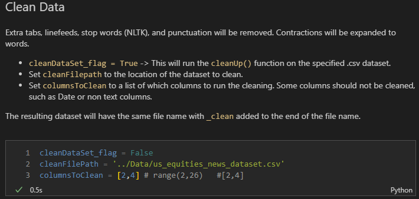
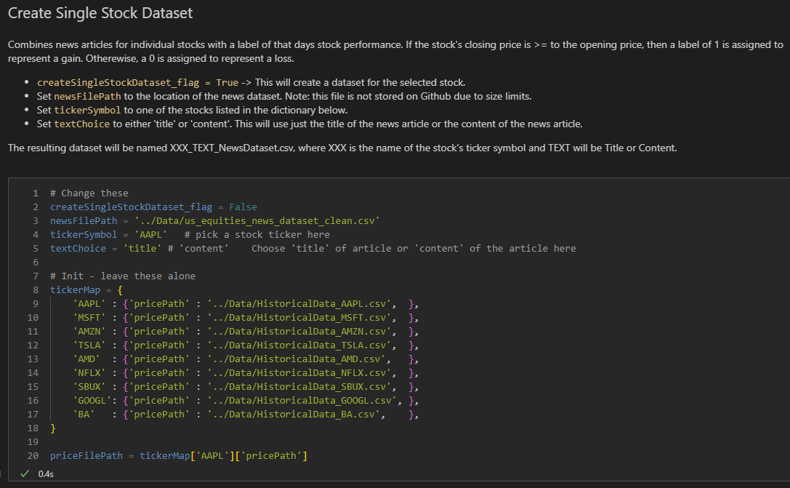
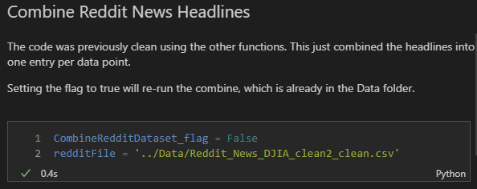
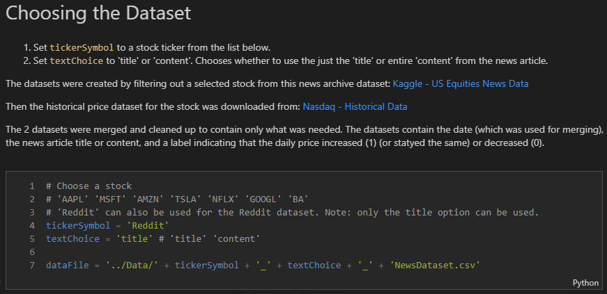
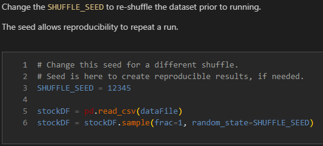
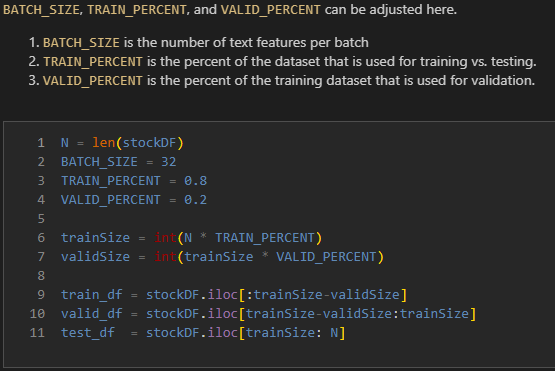
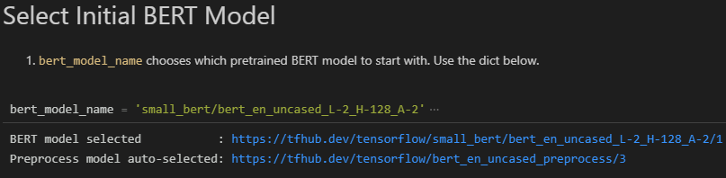
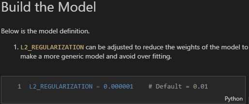
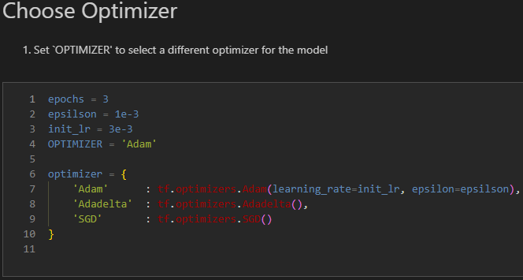
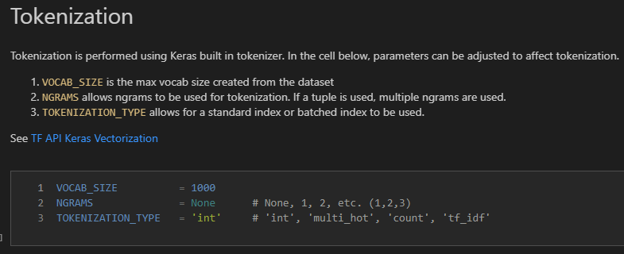

# CourseProject

This ReadMe is the documentation for the CS410 class project.

[Video Presentation Link](https://drive.google.com/file/d/1s1JghaXXxCa3Itg97BQNOT3ILO6--6XW/view?usp=share_link)

**TLDR** The video presentation explains how to install and use the libraries included in the project. If you do not have the ability to perform these operations, [here is a link](https://colab.research.google.com/drive/1NsvL0vMhW-IumluK2sKA9A0taZoewGD4?usp=share_link) for a public demo of the project. It does not include the many datasets discussed in the video presentation, but does allow for the model to be tweaked.

## Group Info

| Number | Name | ID |
| :---: | :---: | :---: |
| 1 | Michael Bencsik | bencsik2 |

## Free Topic

The goal was to use existing tool kits to classify news headlines and/or articles as either having positive or negative sentiment using the increase or decrease of the market price as the model's label.  

The main tool kit chosen was TensorFlow. This project is an explanation and example of the usage of the TensorFlow API.

## Overview

There are three notebooks being submitted. The first notebook cleaned and organized datasets into a format that was usable in the other two notebooks. The cleaning function can be used on future .CSV datasets, and uses the included CleanData.py file. This file can be updated by anyone to adapt the text preprocessing to their own needs.

The other two notebooks are binary text classification models with one using BERT and the other using an RNN model. BERT is a pretrained model that is fine tuned to a new dataset. [This article](https://arxiv.org/pdf/1810.04805.pdf) gives a great explanation of BERT. Tensor Flow includes a [large list](https://www.tensorflow.org/text/tutorials/classify_text_with_bert#choose_a_bert_model_to_fine-tune) of pretrained BERT models to choose.

The [RNN model](https://developers.google.com/machine-learning/glossary/#recurrent-neural-network) is a recurrent neural network that uses the previously learned weights from a bidirectional layer as additional inputs to the layer on the next iteration. This is an attempt for the model to learn the entire sequence of text.

**NOTE:** The RNN model can be replaced by any neural network or [Keras Layer Classes](https://www.tensorflow.org/api_docs/python/tf/keras/layers). With this notebook the RNN portion of the model is only in one cell. This leaves the text tokenization, optimizers, loss classes, and metrics for any binary text classification problem.

The datasets to choose from are single stock news articles vs. single stock daily price or a mixture of general top Reddit headlines vs. the Dow Jones Industrial Average. These datasets were found to be the most detailed and labeled. Links to the information used for the datasets can be found below in the Data Clean Up section.

### Required Libraries

This project was performed and tested using the below specifications.

| Specification | Value |
| :- | :- |
|Processor | 12th Gen Intel(R) Core(TM) i5-12600K   3.70 GHz |
|Installed RAM | 64.0 GB (63.8 GB usable) |
|System type | 64-bit operating system, x64-based processor |
|Edition | Windows 11 Home |
|Version | 22H2 |
|Installed on | 10/10/2022 |
|OS build | 22621.819 |
|Experience | Windows Feature Experience Pack 1000.22636.1000.0 |

Below is a list of libraries and toolkits that need to be installed to use the notebooks. Other versions of the libraries may be used, but these are the versions used at the time of creation. Conflicts may arise from using different versions than listed.

| Library | Version | Required | Install Method |
| :- | :- | :- | :- |
| Python  | 3.10.8 | Yes | [Python 3.10.8](https://www.python.org/downloads/release/python-3108/) |
| contractions | 0.1.73 | Yes | pip install contractions |
| NLTK | 3.7 | Yes | pip install nltk |
| NLTK Data | 3.7 | Yes | [Interactive Installer](https://www.nltk.org/data.html#interactive-installer) |
| Pandas | 1.5.1 | Yes | pip install pandas |
| TensorFlow | 2.10.0 | Yes | pip install tensorflow==2.10.0 |
| TensorFlow Hub | 0.12.0 | Yes | pip install tensorflow-hub |
| TensorFlow Text | 2.10.0 | Yes | pip install tensorflow-text |
| TensorFlow Datsets | 4.7.0 | No | pip install tensorflow-datasets |
| Matplotlib | 3.6.2 | Yes | pip install matplotlib |
| Numpy | 1.23.4 | Yes | pip install numpy |

Depending on you OS and setup, you may have to use:

    <PATH TO PYTHON>/python.exe -m pip install <MODULE>

Make sure pip is up to date:

    pip install --upgrade pip

    or

    <PATH TO PYTHON>/python.exe -m pip install --upgrade pip

The dataset that was used for individual stock news is too large for a free GitHub account. Below are the links to the original and the cleaned version. You do not need to download as there are already cleaned up datasets in the repository for some examples.

[us_equities_news_dataset.csv](https://drive.google.com/file/d/1MSc4Biirl-zCWTar4xi-FPE40M4h1gea/view?usp=share_link)

[us_equities_news_dataset_clean.csv](https://drive.google.com/file/d/1mekdVwy_cl4HDfg66psoWq55NM5M6SBy/view?usp=share_link)

### Data Clean Up

The `Data Clean` notebook demonstrates the dataset clean up that was required before processing the datasets. This notebook is split into 3 parts.

The first part will clean text by removing a lot of misc. characters and punctuation that was found in most of the datasets, remove stop words, remove extra spaces, and lower the case of the characters. Then, a new file will be saved with `_clean` added to the end of the file name.

To use, set the flag to `True`, change the `cleanFilePath` to your csv dataset location, and set `columnsToClean` to a list of the text (string) columns to clean up. Then, run the notebook.

The second part creates an individual stock dataset by combining a very large financial news dataset and a stock price dataset. The large financial news dataset was too large to upload to GitHub.

I will attempt to link the news dataset from my Google Drive. The dataset can be downloaded from [Kaggle - US Financial News](https://www.kaggle.com/datasets/gennadiyr/us-equities-news-data?resource=download). The individual stock prices were downloaded from [Nasdaq Historical](https://www.nasdaq.com/market-activity/quotes/historical). The code filters the news by stock ticker, creates a binary label for the stock price based on if the day is positive or negative, then combines the data into a single dataset to be used for the model. Set the flag to `True`, select the stock ticker from the list shown, then choose whether to use the news article title or content. Run the notebook to create a new csv dataset for the individual stock.

The last part of the notebook combines 25 columns of news titles from a Reddit stock market dataset from [Kaggle - Reddit Dow Jones](https://www.kaggle.com/datasets/aaron7sun/stocknews). This was done to create one data point per label. Set the flag to `True` and run the notebook to create the combined dataset.

 - - -

### Models

The two final models that were detailed enough to present are based on TensorFlow's text classification tutorials [BERT](https://www.tensorflow.org/text/tutorials/classify_text_with_bert) and [RNN](https://www.tensorflow.org/text/tutorials/text_classification_rnn). The original source code has been modified greatly to use my datasets and to allow for easy customization of the models features. These models are found in the `Sentiment - TF BERT` and `Sentiment - TF RNN` notebooks.

The initial dataset setup is similar in both notebooks, since they use the same datasets.

Select a stock ticker symbol or the Reddit dataset from the list shown. Select whether to use the news article title or content. The notebooks use the datasets that were created from the `Data Clean` notebook.

Next the `SHUFFLE_SEED` can be changed to shuffle the dataset. The seed is there in case the user would like to reproduce certain results.

The user can choose how to split the datasets into training, validation, and testing sets. The batch size can also be adjusted.

### BERT

For the BERT model, a preprocessed BERT model needs to be selected. Expand the cell shown in the picture below and select a model provided by TensorFlow.

L2 regularization can be adjusted to smooth the losses of the model in training. This can help with over fitting.

Select which optimizer to use by setting `OPTIMIZER` to the name of the optimizer listed in the dictionary. Any optimizer from [TensorFlow](https://www.tensorflow.org/api_docs/python/tf/keras/optimizers) can be used. It just needs to be added to the dictionary. Select the number of epochs to run by changing `epochs`. If the optimizer uses a learning rate, then set `init_lr` to the desired rate.

Then run the notebook! I would suggest using a small number for `epochs` as the BERT model can take a few minutes to run.

### RNN

For the RNN model, the next step is to tokenize the text input. In the image below, the there are 3 parameters to adjust for tokenization. The tokenization, or vectorization of the text, is performed using [Keras' TextVectorization](https://www.tensorflow.org/api_docs/python/tf/keras/layers/TextVectorization) layer. The API explains the parameters in more depth fro additional clarification. Setting `VOCAB_SIZE` limits the maximum number of vocab tokens for the tokenization. If `TOKENIZATION_TYPE` is changed from `int`, then `VOCAB_SIZE` is per batch. Setting `NGRAMS` to an integer will change the model from a unigram model to the ngram model of the specified integer. Inserting a tuple of integers will cause multiple ngram models to be created. This will increase overall training time.

The RNN model also uses L2 regularization to smooth the losses of the model in training.

Lastly, the settings for training the RNN can be adjusted. The number of `EPOCHS` and `VALIDATION_STEPS` will adjust the total number of iterations and amount of validation data that is ran. Setting `VALIDATION_STEPS = None` will cause all validation data to be ran. See [TF Keras Sequential](https://www.tensorflow.org/api_docs/python/tf/keras/Sequential#fit). Different Keras loss functions can be used by changing `LOSS_CLASS`. More can be added from [Keras Loss Functions](https://www.tensorflow.org/api_docs/python/tf/keras/losses), but this is a binary classification and most of the loss functions are for more than binary models. `OPTIMIZER` selects the [Keras Optimizer](https://www.tensorflow.org/api_docs/python/tf/keras/optimizers) and `LEARNING_RATE` adjust the rate for the selected optimizer, if it requires one.

That's it! Run the notebook to train the model. This model will run faster than the BERT model, especially if using a unigram vocab model.

## Self Eval

The minimum success criteria from my proposal was to develop a binary text classifier model using news articles/headlines and stock prices. I believe I have successfully developed the classifier, however there appears to be a poor correlation between the input data and the output labels. I tried many other models than the two submitted (BERT and RNN) including Support Vector Machine, Linear Regression, Embedded Bag, and misc Neural Networks. All models produced an approximate accuracy of 50%. Basically, selecting stocks based on news articles is equivalent to flipping a coin.

I feel that if I were to continue this project further, I would like to train models based on more of a moving average or trend line for the stock prices. My dataset labels are too narrow and specific, similar to choosing a single word for a topic in topic categorization instead of a topic distribution. The price most likely lags current news topics, and a loss for the day does not represent the overall direction of the stock price.

The main challenge for this project was acquiring useful datasets. Most datasets were full of garbage or unreliable labels. Cleaning the datasets was not a very scientific process, as I do not have years of experience or time. The process relied heavily on researching common techniques used currently or most often.
